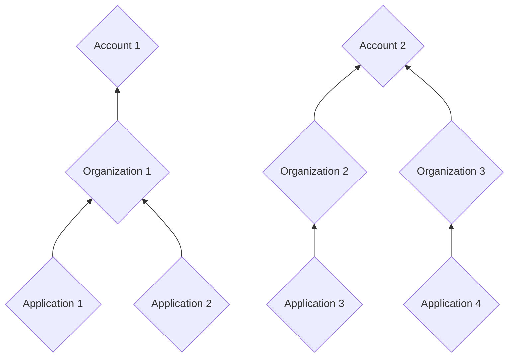
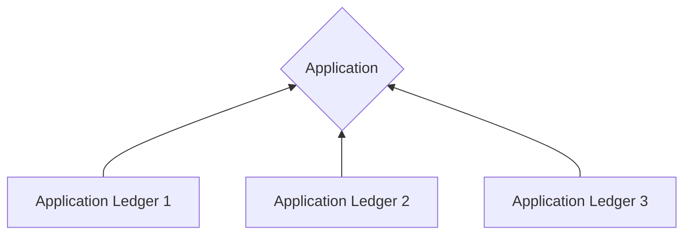
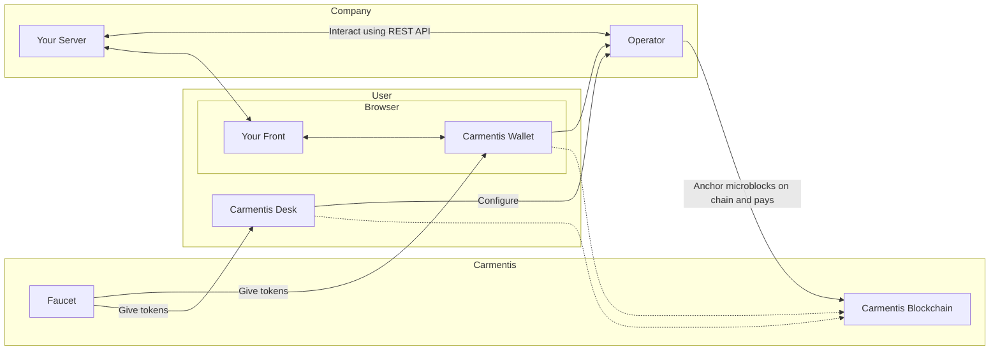
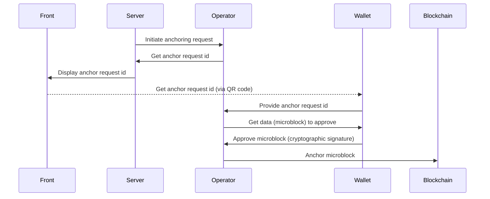

import {DynamicLink} from '@site/src/components/DynamicLink';

# Concepts

The Carmentis chain is structured around several key concepts.
Understanding these concepts will help you better understand the Carmentis ecosystem and how to interact with it.


## Chain structure

### Accounts, Organizations and Applications

Accounts, organizations and applications are the core concepts of the Carmentis ecosystem and are all related to each other
following a **hierarchical structure**, as depicted below.



#### Account
An *account* corresponds to a unique address and associated with a public (signature) key.
As any blockchain, each account is associated with balance, the currency being denoted `CMTS`.

:::info Public key format
These public keys are formatted in a clear way to be easily recognisable by humans: for instance,
the following `SIG:SECP256K1:PK{0358f1fb3e26661f29d6cc5bf31d8fa232030cc8277d2493c29e1913d4a7c9b0c0}` is a public signature
key.  
:::


#### Organization
An organization corresponds to your company and provides information like your company's name or website.
Publishing an organization is mandatory to be able to use the Carmentis protocol, and is currently used to 
organize the data on-chain chain.

#### Application
Similarly to an organization, an application corresponds to a service offered by your organization.
An application describes which website the user should visit to use the service, a name and a description of the service.


### Behind the hood: Microblocks and Virtual blockchains

Everything in the Carmentis's blockchain is composed of two ingredients: **microblocks** and **virtual blockchains**.
In a nutshell, a virtual blockchain is like a standard blockchain, but *simulated* in a blockchain.
As a blockchain is composed of blocks, a virtual blockchain is composed of *microblocks*.
Let's focus on each of these terms.

#### Microblocks

A microblock is the smallest unit of data that can be anchored in the blockchain.
It contains a header containing standard, transaction processing-related information, as well as 
a body where all the data being anchored in the blockchain, including private ones are contained.

Creating a microblock programmatically is as simple as the following code snippet:
```ts
// we create an empty microblock used inside the account virtual blockchain
const mb = Microblock.createGenesisAccountMicroblock();

// we add two sections: a section defining a public key and and a section creating an account.
// The result is the creation of an account associated to some public key.
mb.addSections([
    {
        type: SectionType.ACCOUNT_PUBLIC_KEY,
        publicKey: await accountOwnerPublicKey.getPublicKeyAsBytes(),
        schemeId: accountOwnerPublicKey.getSignatureSchemeId()
    },
    {
        type: SectionType.ACCOUNT_CREATION,
        amount: initialAmount.getAmountAsAtomic(),
        sellerAccount: sellerAccountId
    }
]);
```


#### Virtual blockchains
The virtual blockchain acts as a dedicated logical blockchain in which the content of an application is anchored.
Every execution of an application leads to the creation of virtual blockchain. In other words, multiple
virtual blockchains are attached to a single application. To be more concrete, in case where a lawyer wants signers
to sign a contract, a new virtual blockchain will be created. To avoid confusion, we note that the *block* term refers to a block of the blockchain whereas *micro-block* refers
to a block of the virtual blockchain.  This notion of virtual blockchain is depicted below.


A virtual blockchain anchors all the data  sent by the application to the blockchain, including *private* ones.
Be aware that private data anchored in the virtual blockchain are *not* revealed to the public, standing in contrast
with public data being anchored without any confidentiality protection. To prevent one to access private data without
authorisation, we have introduced another notion atop of the virtual blockchain, called *channels*.

### Application ledger: Where all your data ends

The application ledger virtual blockchain is the ultimate virtual blockchain
where the data you anchor in the blockchain ends. An application ledger
is absolutly required to be associated with an application virtual blockchain.
In the Carmentis model, an application ledger models a *single* transaction flow. For instance, a flow modelling a letter being sent and received is modelled as single application ledger. Hence, for a single application virtual blockchain, multiple application ledger virtual blockchains can be created.



#### Channels

When anchoring a data being anchored in an application ledger virtual blockchain, the data are splitted among *channels*.
A channel is the cornerstone of the feature allowing *asymmetry of information*.
A channel can be either *public*, so all the data being put in this channel remains in clear, or *private*. In the latter case, the data remains (symmetrically) encrypted. 


Let focus on the encryption in private channels. For clarity and simplicity, we will omit few details about the real cryptography employed in the application ledger and focus on the following simplified fact: Every private channel is associated with a *dedicated* symmetric encryption key. Everytime you are anchoring private data on private channel, these are encrypted using the symmetric encryption key associated with the channel. In a nutshell, asymmetry of information is acheived by providing channel keys to users that should be able to access information on a particular channels.

Of course, channel keys are *not* distributed on-demand, otherwise breaking all the security. Instead, we are relying on *public-key encryption* in which one can use a public-key to encrypt a message, only the user (or device) holding the private decryption key can decrypt the message. By encrypting the channel key with the public encryption key, we allow the user to access the private channel by: (1) decrypt the ciphertext encrypting the channel key using its private decryption key, and then (2) decrypt ciphertexts containing data in the channel using the previously decrypted channel key. This approach is similar to the [Envelope or Hybrid encryption](https://en.wikipedia.org/wiki/Hybrid_cryptosystem).

For the most security-aware readers, the following question may arise: 

> *Who is responsible for generating and handling all channel keys?*

In the Carmentis ecosystem, the handling of channel keys are performed 
by *you*. Let's be clearer: in addition to the blockchain, we provide an application-ledger-focused server called an *Operator*. This server should be launched
on your *own* infrastructure and only accessible by *your* services (ensured by an integrated API key system). All the cryptographic operations are already performed in this ready-to-use server, so we provide the server and you run it. 

#### Actors

In the application ledger, an actor simply corresponds to a name, a public signature key (used to authenticated users) and public encryption key (used to share channel keys). That's it! It is even clearer when observing sections used by the operator itself to declare a new actor:

```ts
const mb = new Microblock();
mb.addSections([
    {
        type: SectionType.APP_LEDEGR_ACTOR_SUBSCRIBPTION,
        actorId: 1, // an automatically created id,
        pkePublicKey: new Uint8Array(), // the public encryption key
        signaturePublicKey: new Uint8Array(), // the public signature key
        // ... other non-critial properties are omitted for clarity
    },
    {
        type: SectionType.APP_LEDGER_ACTOR_CREATION,
        id: 1 // an automatically created id,
        name: "Jean Dupont", // a name used to identify clearly the user
    }
])
```

#### Learn by Example: The Luxury Digital Passport

Consider the example of a high-end watch manufacture wanting to guarantee the authenticity of its products throughout their entire lifecycle. The Carmentis protocol is particularly well-suited to handle the **information asymmetry** between the manufacturer, the reseller, and the end customer, while preserving the confidentiality of sensitive data (such as sale price or buyer identity).

Suppose a virtual blockchain has been created for a specific watch (ID: `WATCH_XYZ`). In this case, the virtual blockchain contains three distinct channels:
1. A **Public** channel: Contains the model and serial number, viewable by any potential buyer to verify the object's existence.
2. A **Private (Manufacture)** channel: Contains technical manufacturing details and quality control reports.
3. A **Private (Owner)** channel: Contains the ownership certificate and service history, accessible only to the current holder and authorized service centers.

When developing your application, you specify the channel access rules (`accessRules`), defining which role can access which channel and what data is included.

```javascript
// Data to be anchored in the virtual blockchain (the Ledger)
const watchData = {
  serialNumber: "SN-12345-XYZ",
  modelName: "Master Ultra Thin",
  qualityControlReport: "All tests passed - Tolerance +2s/day", // Manufacture Confidential
  ownerIdentity: "John Doe", // Owner Confidential
  maintenanceLog: "Full service completed on 2024-02-21" // Owner/Service Center Confidential
}

// Channel Access Rules definition
const accessRules = {
  // Fields to be anchored
  data: watchData,
  
  // Channels declaration
  "channels": [
    { "name": "publicRegistry", "public": true },  // Visible to everyone
    { "name": "manufacturingSecret", "public": false }, // Encrypted
    { "name": "ownershipVault", "public": false } // Encrypted
  ],

  // Data splitting into channels
  "permissions": {
    "publicRegistry": [ "this.serialNumber", "this.modelName" ],
    "manufacturingSecret": [ "this.qualityControlReport" ],
    "ownershipVault": [ "this.ownerIdentity", "this.maintenanceLog" ]
  },
  
  // Actors declaration (roles)
  "actors": [ 
    "operator",    // The Manufacture's system
    "factory_qa",  // Quality Assurance department
    "customer"     // Final buyer
  ],
  
  // Access attribution to actors
  "subscriptions": {
    "operator": [ "manufacturingSecret", "ownershipVault" ], 
    "factory_qa": [ "manufacturingSecret" ],
    "customer": [ "ownershipVault" ]
  },
  
  // Application virtual blockchain ID
  "applicationId": 8888
}
```

In this example, the subscriptions and permissions fields ensure that a casual observer can verify that watch SN-12345-XYZ is authentic via the public channel, but only John Doe (the customer) can prove ownership or view maintenance records via the ownershipVault channel—all without this private data ever being exposed in clear text on the blockchain.


## Ecosystem Overview
This diagram illustrates the Carmentis ecosystem architecture. 
Users interact with the system through **Carmentis Desk** (desktop application) and a 
**Browser** containing their front-end application and the **Carmentis Wallet** extension. 
The company operates a server that communicates with the **Operator** via REST API, which 
serves as the bridge between the application layer and the blockchain. The **Faucet** provides 
tokens to both the Carmentis Wallet and Desk for testing or initial funding. The Operator anchors 
microblocks on the **Carmentis Blockchain** and handles transaction fees, while both the Wallet 
and Desk maintain connections to the blockchain for verification and monitoring purposes.


### Carmentis Operator

As explained previously, the handling of channel keys are performed by the Carmentis Operator. This part of the ecosystem is critical in many ways:

- First, as explained, it handles all cryptographic keys.
- Second, recall that the operator anchors encrypted data in the application ledger, which means that it publishs on the blockchain. It then follows that publishing (microblocks) on the blockchain implies to pay *fees* to validator nodes.
Therefore, the Carmentis Operator should have access to a private signature key, whose the public signature key is associated to a sufficiently-funded account. Otherwise, the microblock will be rejected.
- Third, it makes your experience with the Carmentis ecosystem by handling many technicalities needed to publish.
- Fourth, it is at the core our of application ledger *protocol* used to obtain the wallet's signature for a microblock. We have displayed below a (simplified) sequence diagram illustrating the interaction between the
different components of the application ledger protocol.

As you can see, the wallet approves the action by signing it. This 
signed approval takes the form of a [Micro block](#virtual-blockchains-and-channels),
encapsulating all relevant data associated with the event under review. The operator's signature on the [Micro block](#virtual-blockchains-and-channels)
establishes the event's authenticity, allowing it to proceed toward [Wallet](#wallet) validation.



Here are some remarks about the sequence diagram:
- During the anchoring request between the server and the operator, the server *provides the data* and 
*application ledger building instructions* (as previously described in the application ledger section).
Then, the operator follows the instructions to create the application ledger microblock, generates a random anchor 
request identifier and returns it to the server.
- The REST API used by the server to initiate the anchoring request with the operator is *protected* via an API-key system.
Therefore, to use the operator, you must setup the operator accordingly and finally obtain an API key. 
Running the operator can be done via [Docker](docker.io), while configuring the operator is done via the [Carmentis Desk](test). 


### Wallet

In the Carmentis ecosystem, a wallet serves as a secure digital identity that enables users to interact with the protocol.
It stores the user's private keys, which are essential for signing transactions and approving actions within the system.
The wallet facilitates authentication, allowing users to log into applications without relying on traditional usernames
and passwords. Moreover, it enables users to manage their approvals and share proofs of actions securely, all while
ensuring privacy by keeping personal data confidential. Overall, the wallet is a crucial component that enhances security
and usability within the Carmentis framework.


### Carmentis Desk

Carmentis Desk can be viewed as a Carmentis Wallet but for desktops.
But it is more than just a wallet: while the Carmentis Wallet 
only focus on dealing with the tokens and to interact with a web application,
Carmentis Desk allows the handling of multiple wallets, but also to claim nodes and stake tokens. Even more, Carmentis Desk serves as an *administration console* to control your operators. The latter point is crucial: it gives you an access to the state of your operators including allowed users, wallets available in the operator and finally to generate API keys. We recommand you to visit the <DynamicLink id="desk"/> to get more details.


## Proof of authenticity

With the advance of artificial intelligence used to produce close-to-real data including official documents,
a shift of paradigm has been initiated, in which a document in considered false unless a proof of authenticity is
provided. A natural following question might be "What kind of proof can we use to prove authenticity"?

It is exactly this point that Carmentis is trying to address, by providing an easy-to-use and flexible method to generate
and share a proof of authenticity: The core of the proof mechanism is based on both the blockchain and on a cryptographic
hash-based construction called a Merkle-tree. In few words, a Merkle-tree allows one, the prover, to create a so-called *hash root*
over a given set of data. This hash root is anchored in the blockchain, preventing a tampering of this hash root. The prover
then generates a proof of authenticity for a given subset of the data being inputted to compute the hash root. Later, the
proof verifier, given the hash root anchored in the blockchain, the proof and the subset of data being inputted by the prover
during the proof generation, can efficiently verify the authenticity of the
same subset of the data.

An interesting property is that all the data being out of the subset used during the proof generation and proof verification
do not have to be revealed. From an efficiency purpose, the Merkle-tree allows a *short* proof and an efficient
proof verification.


Find more information about [how to generate a proof](./how-to/generate-proof) and [how to verify a proof](./how-to/verify-proof)
in the dedicated documentation pages.


## Themis network (Testnet)

The currently deployed Testnet in Carmentis is called **Themis**. This network is composed of two types of nodes:
Replication nodes and validator nodes. A *replication node* receives an approved event from the
[operator](#operator), taking the form of a micro-block, later being anchored in the chain.
A *validation node* follows the same specification of the replication node, and is also in charge to validate the
micro blocks, create the master blocks and anchor them in the blockchain.

The Carmentis network is composed of three validator nodes:

|Validator name|Validator domain|Validator IPv4| Public key                                     |
|---|---|---|------------------------------------------------|
|**Aphrodite**|`aphrodite.carmentis.io`| `148.113.194.97` | `ircknIP9z3vVHF1J9PmW/Z6cyFoLIVxJ1HibuK2DtgU=` |
|**Apollo**|`apollo.carmentis.io`| `57.128.159.173` | `XJMIspPDnlyo55RhN6X99tpi3vE2V93R+CUBfDirWJ8=`                                               |
|**Ares**|`ares.carmentis.io`| `54.36.209.141` |`2O1nNS8Y1MZBWBBoF9w9wyMs7NVQZp6g56wfim6N7eU=`|

To check the liveness of `Aphrodite`, go to
the following address [http://aphrodite.carmentis.io:26657/status](http://aphrodite.carmentis.io:26657/status).
The URL is the same for `Apollo` and `Ares` validators.

### Static set of validators setup
Currently, the set of validators is static. The list of validators is defined
in the genesis block of Themis, accessible at `http://ares.carmentis.io:26657/genesis`. We provide you the following
(editable) code to observe the genesis.
```js live
/**
 * React component asking the genesis block's data from Aphrodite replication node.
 */
function Component() {
    const [data, setData] = useState(null);

    useEffect(() => {
        const fetchData = async () => {
            const response = await fetch("http://aphrodite.carmentis.io:26657/genesis");
            const result = await response.json();
            setData(result);
        };

        fetchData();
    }, []);

    return (
        <div>
            <pre>{JSON.stringify(data, null, 2)}</pre>
        </div>
    );
}
```

### Replication nodes
In addition to the three existing validators, we have set up a replication node available at
[https://node.testapps.carmentis.io](https://node.testapps.carmentis.io). Be aware that this replication
node is **optional**: We provide all the necessary to let you launch your own node replication node. See the
[dedicated page](./how-to/deploy-node) for more details.


<div class="related-pages">
    <p class="title">Related pages</p>
    <div class="pages">
        <a class="page" href="./how-to/get-your-carmentis-wallet">
            Get your wallet
        </a>
        <a class="page" href="./how-to/wallet-usage">
            Wallet usage
        </a>
    </div>
</div>
