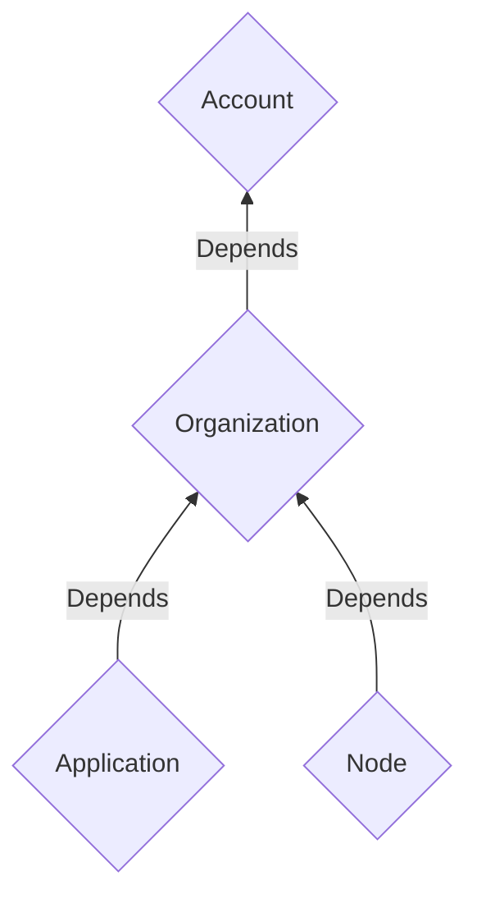
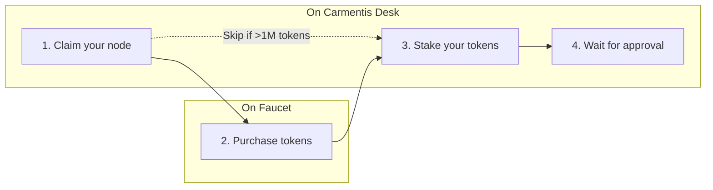

import {RemoteCodeBlock} from '@site/src/components/RemoteFile';
import {DynamicLink} from '@site/src/components/DynamicLink';
import {HighlightedToml} from '@site/src/components/HighlightToml';
import {StatusMessage} from '@site/src/components/StatusMessage';
import Tabs from '@theme/Tabs';
import TabItem from '@theme/TabItem';
import InfoDiffReplicatorValidator from '../../../src/common/info-diff-replicator-validator.md';
import TroubleshootingNode from '../../../src/common/troubleshootings/node.md';
import TroubleshootingDocker from '../../../src/common/troubleshootings/docker.md';
import TroubleshootingOperator from '../../../src/common/troubleshootings/operator.md';
import SecurityConsiderations from '../../../src/common/node/security-considerations.md';

# Claim and stake your node

A validator node is a node that participates in the consensus process.
Since a validator node is basically a replicator node promoted to a validator rank,
if you currently do not have deployed your node yet, we recommend you to follow
the [Deploy your replicator node](./replicator) guide.

As any object in the blockchain, a *node* is modelled as a virtual blockchain and you have to
declare a new virtual blockchain for each node you want to deploy. A node virtual blockchain
is linked to an organization, itself linked to an account. For this reason, you have to declare
account and organization virtual blockchains *before* deploying your node. Once your organization is
published on-chain, you can declare your node. We have depicted below the hierarchical structure of
the account, organization and applications blockchain objects.



## Overview of the process
The process to turn your replicator node into a validator node is quite simple depicted below.



1. The first step is to claim your node.
This step involves that you have already tokens (at least 1M tokens) and that you have an organization on Carmentis Desk.
If you do not have tokens yet, go to the <DynamicLink id="faucet"/> to purchase them.
2. Once your node is claimed, it is time to stake your tokens.
Provide the amount of tokens you want to stake and click on the `Stake` button.
:::note Processing delay
The staking process can take few seconds to apply, please refresh the page to check the status.
:::
3. Once staked, no further action is required from you. Congrats 🥳!
:::info Governance approval
Currently, the chain is in a permissionned phase. So the governance approval is required to promote your node to a validator.
It might take at most a few days to be approved.
:::


### Step 1: Claim your node
To claim your node, go to your running operator and follow the instructions to claim your node.
The operator will declare your node as related to your organization (hence, your organization has to be declared first).
After this step, your node will be visible on the explorer page and shown as visible and claimed in your operator.

### Step 2: Stake your tokens
After your node is declared, you can stake your tokens on your node.
Be sure to have enough tokens to stake.
Still on your operator, in the list of nodes related to your organization, fill the staking form to stake tokens.

:::warning Unstaking process
Only one unstaking operation can be performed at a time for each node and is performed after **30 days** after your
unstaking request, so be sure to put the right amount of tokens before to release the unstake process.
:::


### Step 3: Governance approval
The chain is currently permissionned. For this reason, you need to wait for the governance approval of your node.

:::info Signature request
Before to proceed to the approval, the governance will ask
you to sign a message to prove that you are the owner of the node.
This message can be signed using the CLI as follows, assuming
you are located in the home of your node and that the cometbft
folder is located under the `cometbft` folder:
```shell
cmts cometbft sign ./cometbft/config/priv_validator_key.json <message>
```
Return the generated signature to the governance.
:::


## Next steps

### Checking node status
To check if the node status is alive, you can proceed to the domain name associated where the node is deployed.
A list of endpoints should be displayed. Check one of our nodes, for example, at [https://ares.testnet.carmentis.io](https://ares.testnet.carmentis.io).
Then, click on the `status` endpoint to check the node status and search for the `is_catching_up` and `latest_block_height` fields.
If the value of `is_catching_up` is `true`, the node is still catching up with the blockchain.
If the value is `false` and `latest_block_height` is defined, the node is up, synchronized and running.

### Access to the logs
To check the logs of the node, you can use docker using the `docker compose logs -f` command.

### Stop the node
To stop the node, run the following command:
```shell
docker compose down
```

### Reset the node from scratch
To reset the node from scratch (like a fresh node), you can use the following command:
```shell
# down the ABCI and CometBFT containers
docker compose down node-abci node-cometbft

# clear the local data (be careful, this command will delete all the data, requiring a new synchronization)
cometbft unsafe-reset-all --home ./cometbft && rm -Rf abci

# restart the node
docker compose up -d
```
### Update the CLI
To keep your CLI up-to-date, execute the following method:
```shell
npm update -g @cmts-dev/carmentis-cli
```

## Security considerations
<SecurityConsiderations/>

## Troubleshooting
<TroubleshootingNode/>
<TroubleshootingOperator/>
<TroubleshootingDocker/>
