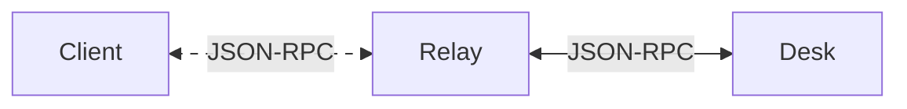
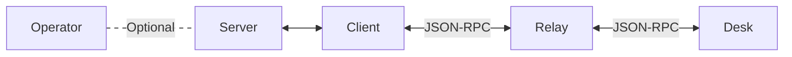

import MarkdownViewer from '@site/src/components/MarkdownViewer';

# Interact with Desk

When running your application, you might need to interact with an end-user and thus with its desk.

## Overview of communications workflow

### Focus on client-to-desk communication workflow

In theory, a client application can directly interact with a desk by sending JSON-RPC requests
through carmentis-provided relays. The general workflow is as follows:



Let's focus on a simple example authentication request sent by a client to desk,
used to authenticate a user by its public signature key.

```html

<!-- This example requires the desk-connect-js library bringing all the necessary dependencies. -->
<script src="https://unpkg.com/@cmts-dev/carmentis-desk-connect-js@1.1.0/dist/index.umd.cjs"></script>
<script type="module">
    // CarmentisConnect is exported by carmentis-desk-connect-js
    const popup = CarmentisConnect.createCarmentisJsonRpcPopup({
        // Indicates the relay to use between this app and desk.
        // There is no need to fully trust the relay (only semi-trusted relays are enough) has
        // all data are AEAD-encrypted before being sent to desk through the relay.
        // Of course, you are free to run your own relay (see https://github.com/Carmentis/carmentis-relay)
        // and use it instead of the one provided by Carmentis.
        // A relay is blockchain-independent (do not care about the 'testnet' in the relay URL). 
        relayUrl: 'https://relay.testnet.carmentis.io',

        // Indicates the title of the popup.
        title: 'Authenticate with Carmentis Desk',
        
        // The JSON-RPC request to send to desk.
        // The `method` field is the name of the JSON-RPC method to call.
        // The `params` field is the parameters to pass to the method.
        request: { 
            jsonrpc: '2.0',
            id: 1,
            method: 'wr-auth-pk',
            params: { base64EncodedChallenge: 'dGVzdA==' },
        },

        // handler for the response
        onResponse(response) {
            console.log('Success:', response.result);
            popup.close();
        },

        // handler for the error
        onError(err) {
            console.error('JSON-RPC error:', err.message);
            popup.close();
        },

        // handler for the popup close
        onClose() {
            console.log('Popup dismissed');
        },
    });

    // display the authentication request
    await popup.open();
</script>
```
The [carmentis-desk-connect-js](https://github.com/Carmentis/carmentis-desk-connect-js) library
provides a simple API and uses a privacy-friendly relay client, also put in place in Desk. Therefore,
every communication between a client and a desk is encrypted and authenticated.


:::info Carmentis Desk Connect for Vue.js
You can also use the [carmentis-desk-connect-vue](https://github.com/Carmentis/carmentis-desk-connect-vuejs) library
to interact with Desk in a Vue.js application.
:::

### Full server-to-desk communication workflow

While being acheivalbe, you may not want the client (i.e., the webpage) to generate 
a challenge to be signed by Desk of your user, but rather to use a challenge already generated by your server.
In the context of anchoring data requiring the approval of a user, you will need to 
first contact your operator to obtain an anchor request id that should be transferred to the Desk of your user.
All these scenarios need an initial setup performed by your server before running the client-to-desk workflow.


## Supported JSON-RPC requests
We introduce below the supported JSON-RPC requests of the last
release of [Desk](https://github.com/carmentis/carmentis-desk).

:::warning Beta development
Remember that *all methods and parameters* are subject to change at any time.
:::


> The documentation below is automatically generated from the [source code of Desk](https://raw.githubusercontent.com/Carmentis/carmentis-desk/refs/heads/master/src/components/rpcSession/walletRequestDocumentation.md).
> :::info Documentation in Desk
> Desk also embeds the documentation below in the Help page.
> :::
> <MarkdownViewer link="https://raw.githubusercontent.com/Carmentis/carmentis-desk/refs/heads/master/src/components/rpcSession/walletRequestDocumentation.md"></MarkdownViewer>